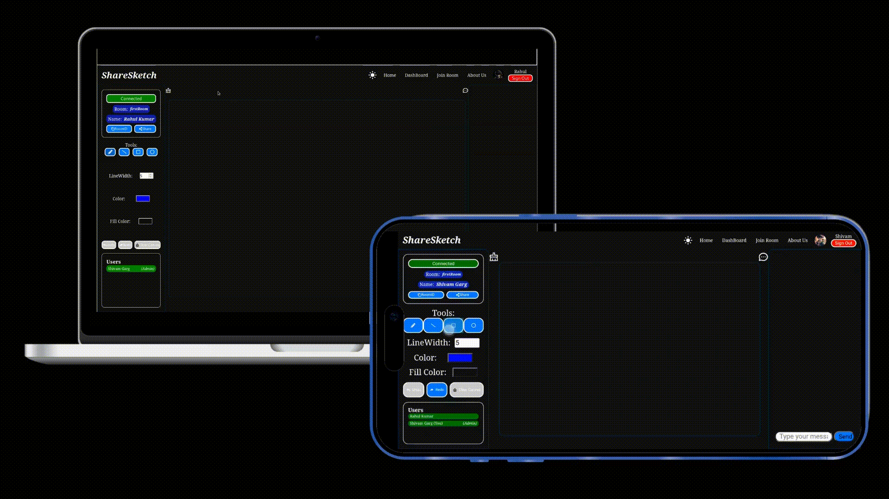
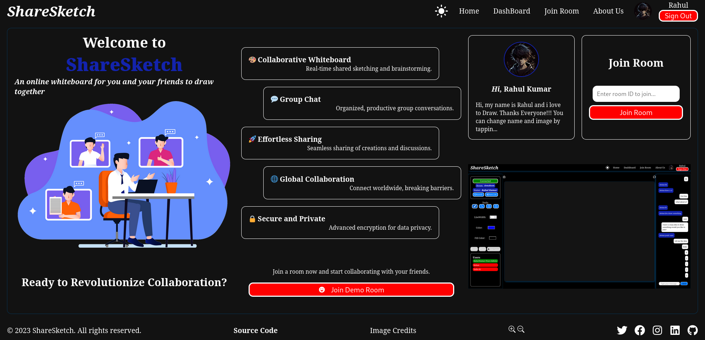
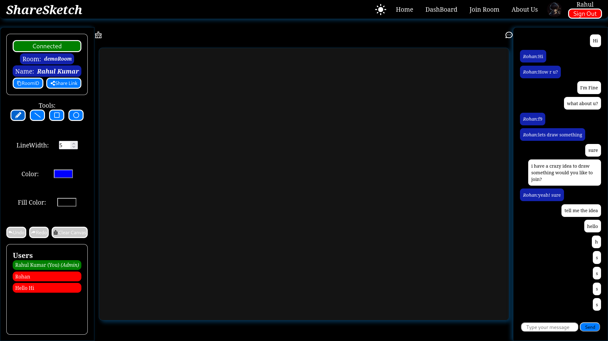

# ShareSketch - Collaborative Drawing and Idea Sharing Platform



ShareSketch is a feature-rich collaborative drawing and idea sharing platform built on the MERN (MongoDB, Express.js, React, Node.js) stack. It enables groups of people to unleash their creativity through real-time drawing collaboration, interactive chat, and seamless sharing of ideas. The project leverages the power of **Socket.IO** to provide a dynamic and engaging environment for users to connect, communicate, and create together.



## Table of Contents

- [Demo](#demo)
- [Features](#features)
- [Installation](#installation)
- [Usage](#usage)
- [Authentication](#authentication)
- [Themes](#themes)
- [Profile Management](#profile-management)
- [Undo-Redo Functionality](#undo-redo-functionality)
- [Active Users List](#active-users-list)
- [Guest User Participation](#guest-user-participation)
- [Transparent Color Objects](#transparent-color-objects)
- [Contributing](#contributing)
- [License](#license)

## Demo

Experience the collaborative power of ShareSketch by exploring our [Live Demo](https://sharesketch-kxge.onrender.com/).

## Features

- 🎨 Create canvas with drawing tools: rectangles, lines, circles, pencils.
- 🤝 Collaborate remotely via Socket.IO: draw, chat, share ideas.
- 💬 Real-time group chat for instant interaction.
- ↩️ Undo-redo for correcting drawing mistakes.
- 🖼️ Profile image upload for personal touch.
- ✏️ User data editing for easy updates.
- 🌓 Toggle between dark and light modes.
- 👥 See the list of active users in the room.
- 👤 Allow guest users to participate.
- 🎨 Supports transparent color objects.

## Installation

To run ShareSketch locally, follow these steps:

1. Clone the repository:

   ```bash
   git clone https://github.com/aslezar/ShareSketch.git
   ```

2. Navigate to the server directory:

   ```bash
   cd ShareSketch/server
   ```

3. Set Environment Variables:

   Create a file named `.env` in the `server` directory, and copy the contents from the `example.env` provided in the repository. Customize the variables as needed.

   ```bash
   cp example.env .env
   ```

4. Install server dependencies:

   ```bash
   npm install
   ```

5. Start the server:

   ```bash
   npm start
   ```

   The server will start on the default port 8080.

6. Return to the project root:

   ```bash
   cd ..
   ```

7. Navigate to the client directory:

   ```bash
   cd client
   ```

8. Install client dependencies:

   ```bash
   npm install
   ```

9. Start the frontend:

   ```bash
   npm run dev
   ```

   The frontend will start on the default port 5173.

10. Open your browser and go to `http://localhost:5173` to experience ShareSketch.

By following these steps, you'll have both the server and frontend components of ShareSketch up and running locally. Setting environment variables ensures proper configuration of the server.

The frontend will start on the default port 5173.

## Usage

1. **Sign Up / Log In:** Create a new account or log in using your credentials or you can even use the demo account option.

2. **Create a New Room:** Initiate a new collaborative drawing session and invite others to join.

3. **Real-Time Drawing:** Employ various drawing tools to collaborate on a shared canvas in real-time.

4. **Chat:** Engage in real-time chat conversations with collaborators to discuss ideas and provide feedback.



## Authentication

ShareSketch employs JSON Web Tokens (JWT) for secure user authentication, ensuring privacy and data integrity.

## Themes

Select between light and dark themes to customize your visual experience and enhance usability.

## Profile Management

Users can personalize their profiles by uploading profile images and updating their name and bio.

## Undo-Redo Functionality

Easily correct drawing mistakes using the undo and redo functionality, providing a smooth drawing experience.

## Active Users List

See the list of active users in the drawing room, enhancing collaboration and interaction.

## Guest User Participation

Enable guest users to join the collaborative drawing sessions, promoting inclusivity and creative exploration.

## Transparent Color Objects

ShareSketch supports transparent color objects, allowing for even more versatile and imaginative drawings.

## Contributing

Contributions are encouraged! Feel free to submit issues and pull requests to help enhance ShareSketch.

## License

This project is licensed under the [MIT License](https://opensource.org/licenses/MIT).

---

Unleash your creativity, collaborate with others, and share your ideas effortlessly with ShareSketch! If you encounter any issues or have suggestions for improvements, please don't hesitate to open an issue on the [GitHub repository](https://github.com/aslezar/ShareSketch).
